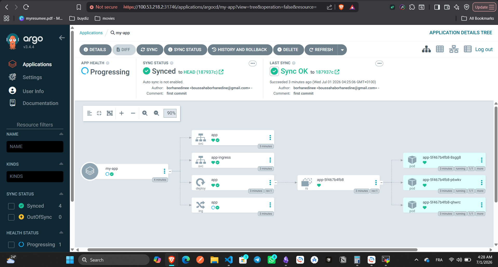
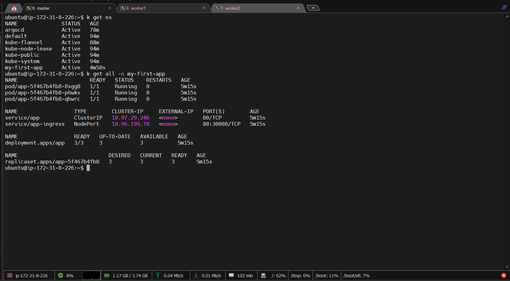
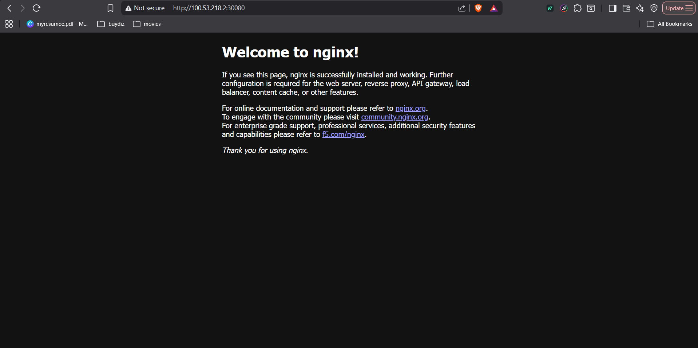

# Argo CD Repo

This repository contains a small GitOps example built with plain Kubernetes manifests and Argo CD.

## Project Overview

The goal of this repo is to deploy a simple nginx application and expose it through Kubernetes resources that are easy to understand and easy to sync with Argo CD.

The setup includes:

- A Deployment named `web-app-deployment` that runs 3 nginx pods
- A ClusterIP Service named `web-app-service` for internal access
- A NodePort Service named `web-app-nodeport` for direct browser access during testing
- An Ingress resource named `web-app-ingress` without a fixed host name

## Manifests

- [manifests/deployment.yaml](manifests/deployment.yaml) - Runs the nginx workload as `web-app-deployment`
- [manifests/service.yaml](manifests/service.yaml) - Exposes the app inside the cluster through `web-app-service` on port 80
- [manifests/ingress-service.yaml](manifests/ingress-service.yaml) - Exposes the app through `web-app-nodeport` on port 30080
- [manifests/ingress.yaml](manifests/ingress.yaml) - Ingress routing through `web-app-ingress` without requiring a domain name

## How It Works

1. Argo CD watches the repository and syncs the manifests.
2. The Deployment creates the application pods.
3. The Services expose the pods inside and outside the cluster.
4. The Ingress resource routes traffic to the web app without needing a specific host value.

## Validation Result

The screenshots in the [results](results) folder show that the deployment was applied successfully and the application is working.

### Screenshot Overview

#### Argo CD UI



This screenshot shows the application synced in Argo CD and the resource tree created from the manifests.

#### Created Cluster Resources



This screenshot shows the namespace objects, pods, deployment, services, and ingress running successfully.

#### Final Nginx Result



This screenshot shows the nginx welcome page opened through the exposed service on port 30080.

These screenshots confirm that the GitOps flow is working end to end: repository -> Argo CD sync -> Kubernetes resources -> reachable nginx page.

## Apply Locally

```bash
kubectl apply -f manifests/
```

## Argo CD Usage

Create or update an Argo CD application to point at this repository and sync the `manifests/` directory.

## Notes

- The Ingress does not require a host name.
- The sample workload uses the `nginx` image.
- The `results/` folder is included as evidence of the successful deployment.
